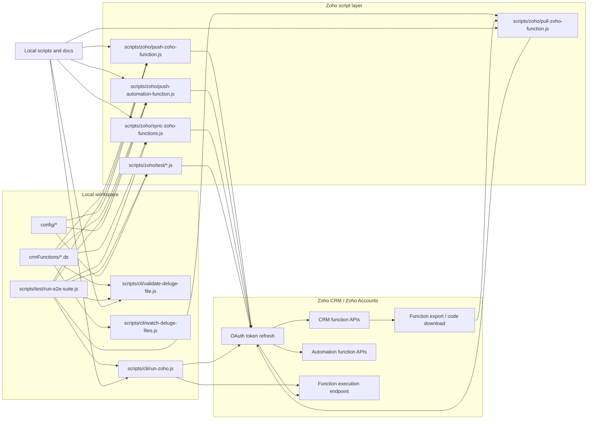

# Zoho CRM Architecture Map

This file shows how the repository pieces connect.

## Reading guide

- `crmFunctions/*.ds` are the source of truth for Deluge code.
- `scripts/cli/` handles local validation and remote execution.
- `scripts/zoho/` handles pushing, pulling, syncing, and targeted tests.
- `scripts/test/run-e2e-suite.js` orchestrates the high-level validation sequence.
- `config/` contains shared settings and overrides.

